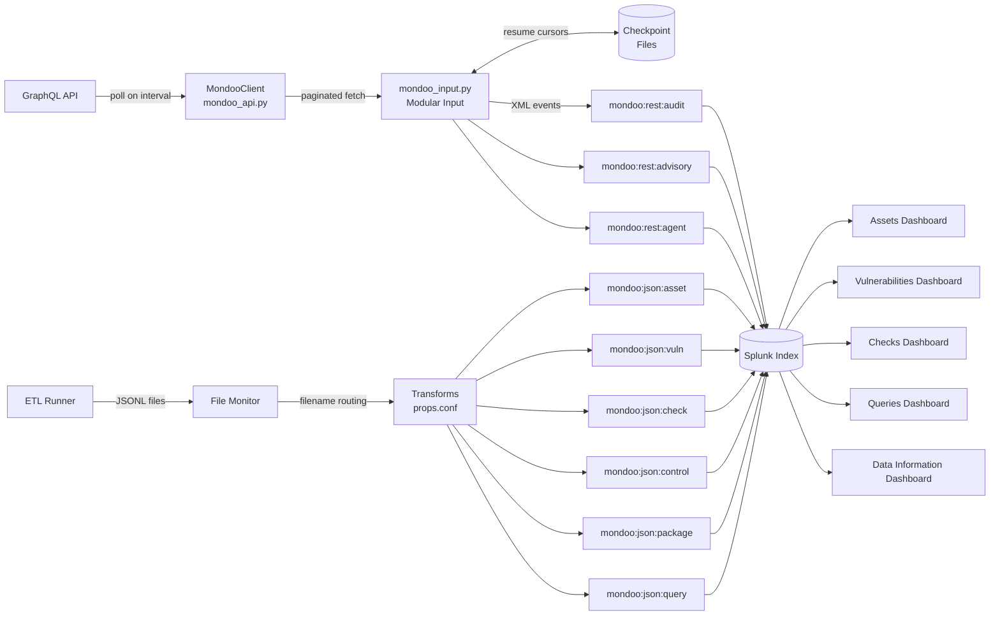

# Splunk Technology Add-on for Mondoo

A Splunk Technology Add-on (TA) that ingests security data from the [Mondoo](https://mondoo.com) platform. Data can be collected via the Mondoo GraphQL API (REST) or from file-based ETL exports.

Source: <https://github.com/mondoohq/splunk-app>

## Apps

This repository contains two Splunk apps:

- **TA-mondoo** — Technology Add-on for data collection (modular input + file monitor)
- **mondoo_app** — Dashboard app for visualizing ingested Mondoo data

## Data Flow



## Data Sources

### REST API (modular input)

The modular input (`mondoo_input.py`) polls the Mondoo GraphQL API on a configurable interval.

| Log Type   | Sourcetype             | Description                                 |
|------------|------------------------|---------------------------------------------|
| audit      | `mondoo:rest:audit`    | Audit trail of actions in your Mondoo space |
| advisories | `mondoo:rest:advisory` | Security advisories                         |
| agents     | `mondoo:rest:agent`    | Registered Mondoo agents                    |

### File-based ETL

A file monitor ingests JSONL exports from the Mondoo ETL runner. Sourcetype routing is handled automatically based on filename.

| File suffix       | Sourcetype            | Description                         |
|-------------------|-----------------------|-------------------------------------|
| `-assets.jsonl`   | `mondoo:json:asset`   | Inventory of monitored assets       |
| `-vuln.jsonl`     | `mondoo:json:vuln`    | Known vulnerabilities across assets |
| `-checks.jsonl`   | `mondoo:json:check`   | Policy check findings               |
| `-controls.jsonl` | `mondoo:json:control` | Security controls                   |
| `-packages.jsonl` | `mondoo:json:package` | Installed packages                  |
| `-queries.jsonl`  | `mondoo:json:query`   | Query results                       |

## Requirements

- Splunk Enterprise 9.0 – 9.3
- A Mondoo account with API credentials (service account JSON blob or raw JWT token)

Both apps declare `requires_splunk_version = 9.0.0` in `app.conf`, which is
what Splunk enforces at install time. `app.manifest` declares a looser
`>=8.0.0` because the Splunk Packaging Toolkit (`slim validate`, a CI gate)
ships a version list that predates 9.0 and rejects a 9.x floor. 9.0 – 9.3 is
the range that is actually tested.

## Deployment topology

The TA performs outbound polling from a single instance. Pick **one** of the
following places to install `TA-mondoo` — installing it on multiple instances
creates duplicate events.

| Topology              | Where to install `TA-mondoo`                       | Where to install `mondoo_app` |
|-----------------------|----------------------------------------------------|-------------------------------|
| Single-server         | The Splunk instance                                | Same instance                 |
| Distributed           | A dedicated Heavy Forwarder (or the search head)   | Search head                   |
| Search-Head Cluster   | A Heavy Forwarder **outside** the cluster          | Each cluster member           |

**Search-Head Cluster caveat.** The modular input is stateful (it writes
checkpoint files under `$SPLUNK_HOME/var/lib/splunk/modinputs/`). Running it
on more than one SHC member produces duplicate events. Disable it on every
member and run it from a Heavy Forwarder instead.

**Splunk Cloud.** Splunk Cloud Victoria/Classic do not allow custom Python
modular inputs in stack apps. To use this TA with Splunk Cloud, run the
modular input on a Heavy Forwarder you operate and forward the events to
your Cloud stack. The `mondoo_app` dashboard app can be installed in the
Cloud stack itself.

## Installation

1. **Download** the `TA-mondoo` directory (or package it as a `.tar.gz`/`.spl` file):

   ```
   git clone https://github.com/mondoohq/splunk-app.git
   ```

   Release packages are also published at
   <https://github.com/mondoohq/splunk-app/releases>.

2. **Copy** it into your Splunk apps directory:

   ```
   cp -r TA-mondoo $SPLUNK_HOME/etc/apps/
   ```

   Alternatively, install via the Splunk UI: **Apps > Manage Apps > Install app from file**.

3. Optionally install `mondoo_app` the same way for dashboards.

4. **Restart Splunk**:

   ```
   $SPLUNK_HOME/bin/splunk restart
   ```

5. Verify the app appears under **Apps > Manage Apps** as "Mondoo Log Ingestion".

## Configuration

### Obtain Mondoo API Credentials

1. Log in to the [Mondoo Console](https://console.mondoo.com).
2. Navigate to your space's **Settings > Service Accounts**.
3. Create a new service account and download the JSON credential blob. It contains the API endpoint, space MRN, and authentication token.

### Configure the REST Input

#### Option A: Splunk Web UI

1. Open the app and navigate to the **Inputs** page (available from the app's navigation bar).
2. Click **Add Input** and fill in the fields:
   - **Mondoo Config Blob** — Paste the full JSON credential blob (or a raw JWT token).
   - **Log Types** — Select data types to collect (audit, advisories, agents).
   - **Index** — Target Splunk index (default: `main`).
   - **Interval** — Polling interval in seconds (default: `300`).
   - **Initial Lookback Days** — On first run, how many days of history to fetch. Set to `0` for all available data (default: `7`).

#### Option B: inputs.conf

Create or edit `$SPLUNK_HOME/etc/apps/TA-mondoo/local/inputs.conf`:

```ini
[mondoo_input://my_space]
interval              = 300
index                 = mondoo
log_types             = audit,advisories,agents
page_size             = 100
initial_lookback_days = 7
mondoo_config_blob    = {"api_endpoint":"https://us.api.mondoo.com","mrn":"//captain.api.mondoo.app/spaces/your-space-id","token":"eyJ..."}
# resource_mrn       = //captain.api.mondoo.app/spaces/<space-id>
```

### Configure the File Monitor (ETL)

To ingest file-based ETL exports, add a monitor stanza in `local/inputs.conf`:

```ini
[monitor:///opt/mondoo-etl/export/*.jsonl]
disabled   = 0
index      = mondoo
sourcetype = mondoo:json
crcSalt    = <SOURCE>
```

Sourcetypes are assigned automatically via transforms based on the filename suffix.

### Create a Dedicated Index (recommended)

For production use, create a dedicated index rather than using `main`:

```
$SPLUNK_HOME/bin/splunk add index mondoo
```

Then set `index = mondoo` in your input stanzas.

### Proxy and custom CA

The modular input honours these environment variables when calling the
Mondoo API:

| Variable           | Effect                                                                                                              |
|--------------------|---------------------------------------------------------------------------------------------------------------------|
| `HTTPS_PROXY`      | Outbound HTTPS proxy URL.                                                                                           |
| `MONDOO_CA_BUNDLE` | Path to a custom CA bundle (PEM). Use when Mondoo is fronted by a corporate CA. Falls back to `REQUESTS_CA_BUNDLE`. |

Set these in the launch environment of `splunkd`, e.g. via your init system,
`/etc/default/splunk`, or a systemd `Environment=` directive.

### Sizing and license impact

Indicative event volumes (audit + advisories + agents at 5-minute polling for
a 1,000-asset space):

| Source                 | Approx. daily volume |
|------------------------|----------------------|
| `mondoo:rest:audit`    | 50–500 KB            |
| `mondoo:rest:advisory` | 5–50 MB              |
| `mondoo:rest:agent`    | 1–5 MB               |
| `mondoo:json:asset`    | 10–100 MB            |
| `mondoo:json:vuln`     | 50–500 MB            |
| `mondoo:json:check`    | 100 MB – 1 GB        |

Trim noise by:
- omitting log types you don't need from `log_types`
- running the input at a longer `interval` for low-change data
- excluding noisy sourcetypes from your retention/storage class

### Where the input logs

The modular input writes to `splunkd.log`. Tail it with:

```
$SPLUNK_HOME/bin/splunk cmd btool --debug | true   # ensure logs are flushed
tail -F $SPLUNK_HOME/var/log/splunk/splunkd.log | grep -E 'mondoo_input|mondoo_api'
```

Or search in Splunk itself:

```
index=_internal source=*splunkd.log (mondoo_input OR mondoo_api)
```

JWT/Bearer tokens are scrubbed from every log line by a logger filter, so
it's safe to share these excerpts in support tickets.

## Dashboards (mondoo_app)

The dashboard app provides the following views:

| Dashboard        | Data                                                        |
|------------------|-------------------------------------------------------------|
| Assets           | Asset inventory with scores, trends, and platform breakdown |
| Vulnerabilities  | CVE findings with severity and asset counts                 |
| Checks           | Policy check results with drilldown by asset                |
| Queries          | Query data coverage and error analysis                      |
| Data Information | Sourcetype indexing status and license usage                |

Dashboards use the `mondoo_index` macro (defaults to `index=mondoo`).

## Development

### Running Tests

```bash
cd TA-mondoo/tests
./setup_venv.sh                    # One-time: creates a Python 3.9 venv
source .venv/bin/activate
python test_mondoo_input.py        # Unit + integration tests
python test_mondoo_input.py live   # Smoke test against the live Mondoo API
```

### Vetting (AppInspect)

Run the vetting script to package and validate both apps:

```bash
./vet.sh
```

This packages each app as a `.tar.gz`, runs `splunk-appinspect` in precert mode, and reports results. Requires `libmagic` (`brew install libmagic` on macOS).

### Deploying to a Dev Instance

```bash
SPLUNK_HOST=splunk.dev.example.com ./sync.sh           # over SSH
DRY_RUN=1 SPLUNK_HOST=host ./sync.sh                   # preview only
SPLUNK_HOST=host SPLUNK_APPS_DIR=/opt/splunk/etc/apps ./sync.sh
```

This rsyncs both `TA-mondoo` and `mondoo_app` to the remote Splunk instance.
Restart Splunk afterwards:

```
ssh "$SPLUNK_HOST" sudo /opt/splunk/bin/splunk restart
```

### Cutting a release

Releases are driven by tags. `.github/workflows/release.yml` refuses to publish
unless the tag, both `app.conf` files and both `app.manifest` files all agree on
the same version, so bump them together first:

| File | Fields |
|------|--------|
| `TA-mondoo/default/app.conf`, `mondoo_app/default/app.conf` | `[launcher] version`, `[id] version` |
| `TA-mondoo/app.manifest`, `mondoo_app/app.manifest` | `info.id.version` |

`./bump-version.sh X.Y.Z` sets all five fields at once and refreshes
`[install] build`, which Splunk uses to decide whether an install is an
upgrade. The release workflow rejects a build number that hasn't increased
since the previous tag, so don't hand-edit the versions.

Then add a dated `## [X.Y.Z] - YYYY-MM-DD` section to `CHANGELOG.md` — the
release notes are generated from it — commit, and tag:

```bash
git tag -a v1.0.0 -m "Mondoo Splunk apps 1.0.0"
git push origin v1.0.0
```

The workflow re-runs the full CI pipeline against the tagged commit, packages
both apps via `./vet.sh --package-only`, checks the packages contain no
`local/`, `tests/` or token-shaped strings, and publishes a GitHub release with
`TA-mondoo-X.Y.Z.tgz`, `mondoo_app-X.Y.Z.tgz` and `SHA256SUMS`.

Rehearse without publishing at any time:

```bash
gh workflow run Release -f version=1.0.0
```

Splunkbase has no publish API — if you list there, upload the `.tgz` files
manually after the release lands.

## Troubleshooting

### The input doesn't appear after install

- Make sure `bin/mondoo_input.py` is executable: `chmod +x bin/mondoo_input.py`.
- Verify the script is registered: `splunk btool inputs list mondoo_input --debug`.
- Check `splunkd.log` for `ExecProcessor` errors at the time of restart.

### "Mondoo API HTTP 401" / "GraphQL errors: ... unauthorized"

The token is invalid or has expired. In the Mondoo console, create a new
service account and paste the fresh JSON blob into the input.

### "Mondoo API HTTP 429" / rate-limit messages

The TA already retries 429 responses with exponential backoff (and honours
`Retry-After` headers). Persistent 429s mean either too many simultaneous
inputs against one space or too small an `interval` — raise `interval` or
split the work across narrower stanzas.

### Custom CA / corporate proxy errors

Set `MONDOO_CA_BUNDLE` and/or `HTTPS_PROXY` in `splunkd`'s environment — see
[Proxy and custom CA](#proxy-and-custom-ca).

### "No new events" after a restart, or duplicate events

Checkpoint files live under
`$SPLUNK_HOME/var/lib/splunk/modinputs/mondoo_input/`. To force a full
re-fetch, stop the input, delete the relevant checkpoint file, and re-enable
the input. To verify the input only runs in one place, see the
[SHC caveat](#deployment-topology).

### Validating credentials manually

```bash
cd TA-mondoo/bin
python3 -c "
from mondoo_api import MondooClient, parse_config_blob
creds = parse_config_blob(open('/path/to/mondoo.json').read())
c = MondooClient(**{k: creds[k] for k in ('token','api_endpoint','space_mrn')})
print('OK' if c.validate() else 'FAIL')
"
```

## Acknowledgments

These apps were developed with substantial help from
[Netdescribe](https://www.netdescribe.com):

- **Alexander Skripnik** — Netdescribe
- **Ilker Duman** — Netdescribe

Thank you both for the Splunk expertise, dashboard work and testing that
shaped this integration.

## Support and contributing

- **Issues / feature requests:** <https://github.com/mondoohq/splunk-app/issues>
- **Pull requests:** <https://github.com/mondoohq/splunk-app/pulls>

CI runs ruff, unit tests, app-file validation, `slim validate` and AppInspect
on every pull request — see
[.github/workflows/ci.yml](.github/workflows/ci.yml).

## License

Apache-2.0 — see [LICENSE](LICENSE).
